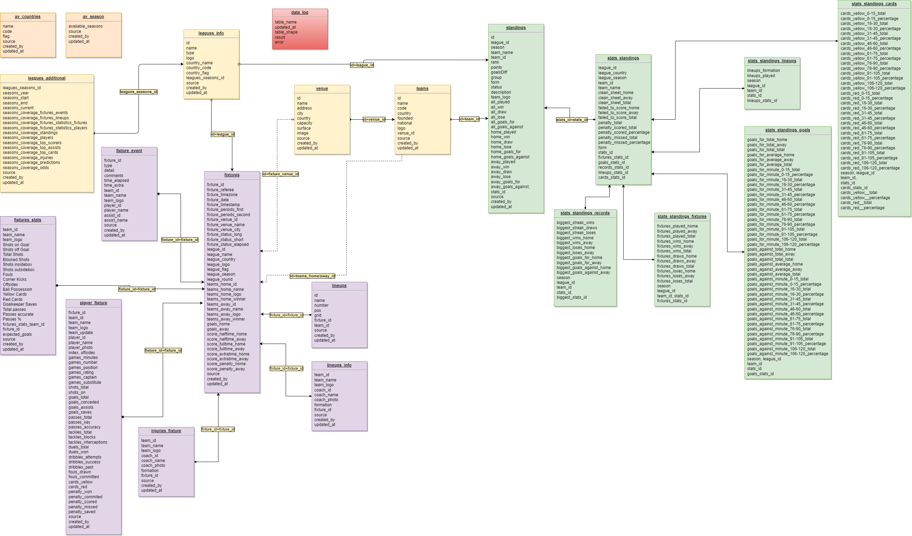

# footballAPI_V2

# EER (Data schema)

## tables 
- data_log (data load log table)
- av_countries (available countries in data)
- av_seasons (available seasons in data)
- leagues_info (leagues information)
- leagues_additional (info about available data by leagues)
- venue (info about teams stadium or fixture stadium (if match played in neutral place)) 
- teams (teams info) 
- standings (standings data)
- stats_standings (teams statistic)
- stats_standings_fixtures (fixtures counts)
- stats_standings_goals (goals details statistic)
- stats_standings_records (ATH statistic)
- stats_standings_lineups (statistic by formation)
- stats_standings_cards (cards statistic)
- fixtures (general matches info)
- fixtures_event (matches events data)
- fixtures_stats (matches stats by fixture)
- player_fixture (players stats in matches)
- lineups_info (general lineups data)
- lineups (players lineups in matches)

## EER

